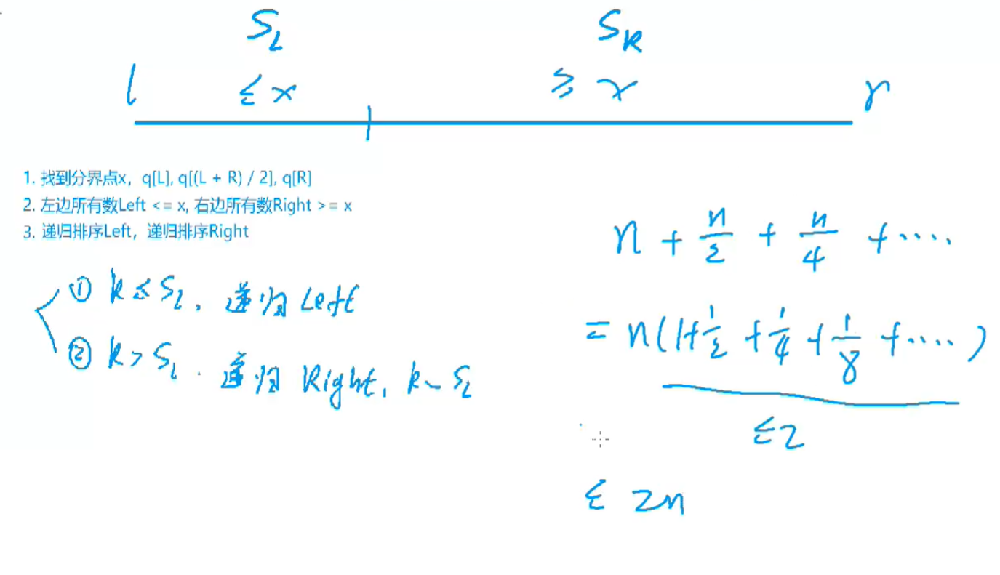
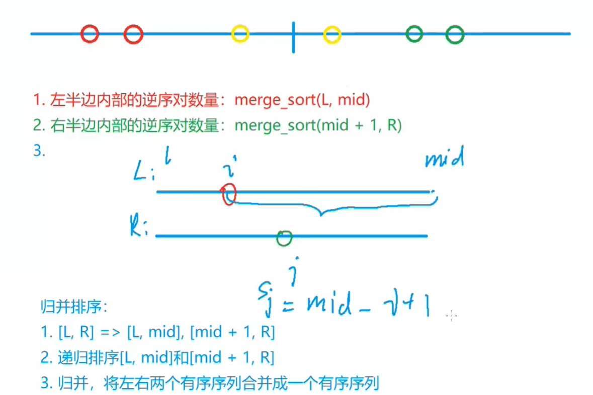
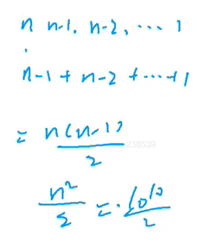
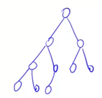
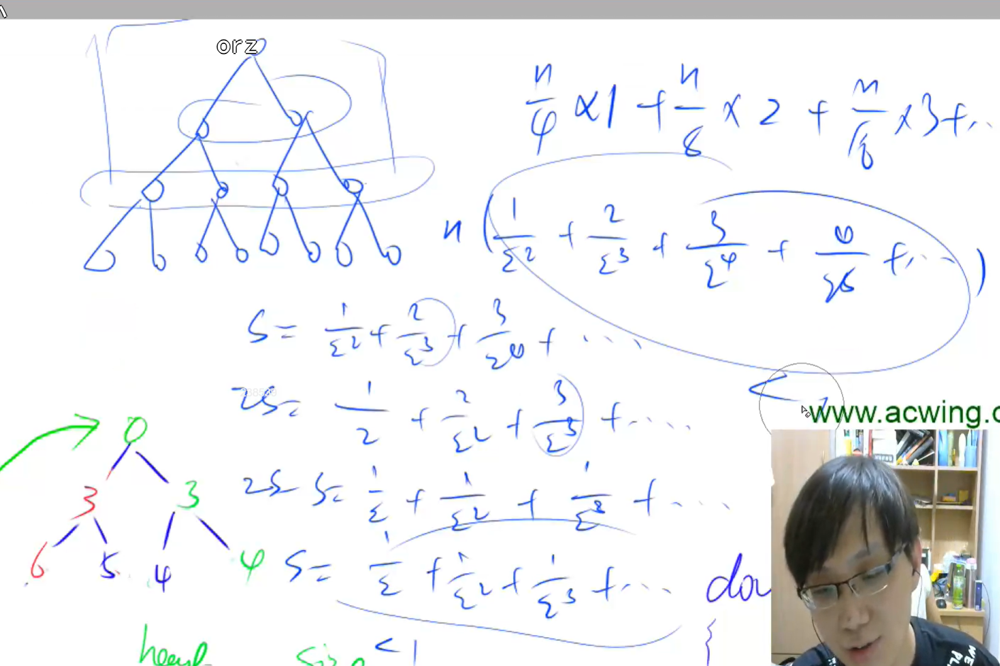
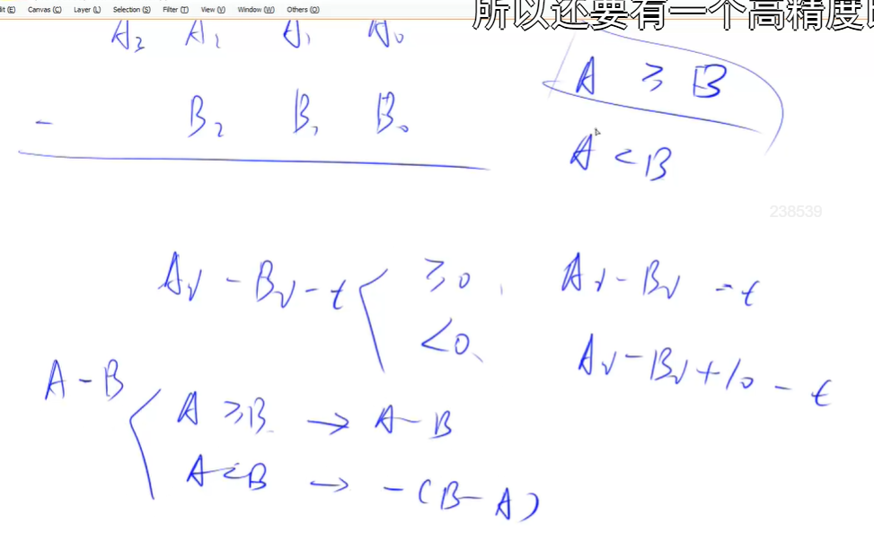

# 基础算法

## 快速排序

分治

（1）确定分界点：是左节点，中间节点，右节点，随机节点都无所谓。

（2）调整区间：所有小于等于分界点的数在左边，大于等于分界点的数在右边。（双指针往中间靠，要两者都找到不符合规则的数，才交换）

（3）递归处理左右两段。


边界问题处理起来很麻烦，建议直接背。（注意quicksort的边界选j，并且i和j初始化时都在边界外，因为后面要++）

注意，此种写法中分界点不一定是x。

```c++
#include<iostream>
using namespace std;

const int N = 1e5 + 10;

void quicksort(int* nums, int l, int r){
    if(l == r) return;
    int x = nums[(r+l)>>1];
    int i = l-1;
    int j = r+1;
    while(i < j){
        do{i++;}while(nums[i] < x);
        do{j--;}while(nums[j] > x);
        if(i < j) swap(nums[i], nums[j]);
    }
    quicksort(nums, l, j);
    quicksort(nums, j+1, r);
}

int main(){
    int n  = 0;
    int nums[N] = {0};
    scanf("%d", &n);
    
    for(int i = 0;  i < n; ++i){
        scanf("%d", &nums[i]);
    }
    
    quicksort(nums, 0, n-1);
    
    for(int i = 0; i < n; ++i){
        printf("%d ", nums[i]);
    }
    
}
```


## 第k小的数

快速选择，每次只要选一边来递归即可。



时间复杂度是2N，是O（N）级别的。

```
#include<iostream>
using namespace std;

const int N = 1e3+10;
int nums[N] = {0};

int quickselect(int l, int r, int k){
    if(l == r) return nums[l];
    int x = nums[(l+r) >> 1];
    int i = l-1;
    int j = r+1;
    while(i < j){
        do{
            i++;
        } while(nums[i] < x);
        do{
            j--;
        }while(nums[j] > x);
        if(i < j) swap(nums[i], nums[j]);
    }
    
    int sl = j - l + 1;
    if(k <= sl)
        return quickselect(l, j, k);
    return quickselect(j+1, r, k-sl);
}


int main(){
    int n, k = 0;
    
    cin >> n >> k;
    for(int i = 0; i < n; ++i){
        cin >> nums[i];
    }
    cout << quickselect(0, n-1, k);
    
    
    
}
```


## 归并排序

为了稳定，在比较时，如果后者数组中的数不大于前者数组的数，就优先选择前者数组中的数。

```c++
#include<iostream>
using namespace std;

const int N = 1e5+10;
int nums[N], tmp[N];


void merge_sort(int nums[], int l, int r){
    if(l >= r){
        return;
    }
    int mid = (l+r) >> 1;
    merge_sort(nums, l, mid);
    merge_sort(nums, mid+1, r);
    
    int k = 0;
    int i = l;
    int j = mid+1;
    while(i <= mid && j <= r){
        if(nums[i] <= nums[j]){
            tmp[k++] = nums[i++];
        }
        else{
            tmp[k++] = nums[j++];
        }
    }
    
    while(i <= mid) tmp[k++] = nums[i++];
    while(j <= r) tmp[k++] = nums[j++];
    
    for(int i = 0, j = l; i < k; i++, j++){
        nums[j] = tmp[i];
    }
}


int main(){
    int n;
    cin >> n;
    for(int i = 0; i < n; ++i){
        cin >> nums[i];
    }
    merge_sort(nums, 0, n-1);
    for(int i = 0; i < n; ++i){
        cout << nums[i] << " ";
    }
}
```


## 求逆序对个数

假设左半边和右半边都已经通过归并排序变有序，同时求出了逆序对的个数。







会爆int（2.1*10^8），所以要用long long来存

```c++
#include<iostream>
using namespace std;

typedef long long LL;
const int N = 1e5+10;
LL nums[N], tmp[N];


LL merge_sort(int l, int r){
    if(l >= r) return 0;
    int mid = l+r >> 1;
    int i = l;
    int j = mid+1;
    int k = 0;
    
    LL res = merge_sort(l, mid) + merge_sort(mid+1, r); 
    
    while(i<= mid && j <= r){
        if(nums[i] <= nums[j]){
            tmp[k++] = nums[i++];
        }else{
            tmp[k++] = nums[j++];
            res += mid - i + 1;
        }
    }
    
    while(i <= mid) tmp[k++] = nums[i++];
    while(j <= r) tmp[k++] = nums[j++];
    
    for(int i = l, j = 0; i <= r; i++, j++){
        nums[i] = tmp[j];
    }
    return res;
}


int main(){
    int n;
    cin >> n;
    for(int i = 0; i < n; ++i){
        cin >> nums[i];
    }
    cout << merge_sort(0, n-1);
}
```


## 数的范围

二分的核心思想是每次在一个区间内选择一个小区间进行处理。

二分做题过程：

先随便想一个check函数，然后思考当此时check等于true时，应当如何缩减区间

如果l = mid，那么r = mid - 1，也就是说mid = （l+r+1） >> 1

如果r = mid，那么l = mid + 1，也即是说mid = (l+r) >> 1

二分情况下，退出循环时l=r。


```c++
#include<iostream>
using namespace std;

const int N = 1e5+10;
int nums[N];


int main()
{
    int n, q;
    cin >> n >> q;
    for(int i = 0; i < n; ++i){
        cin >> nums[i];
    }
    
    for(int k = 0; k < q; ++k){
        int x;
        cin >> x;
        int i = 0, j = n-1;
        while(i < j){
            int mid = i+j >> 1;
            if(nums[mid] >= x){
                j = mid;
            }else{
                i = mid + 1;
            }
        }
        if(nums[i] != x){
            cout << "-1 -1" << endl;
            continue;
        }else{
            cout << i << " ";
            
            int l = 0, r = n-1;
            while(l < r){
                int mid = l+r+1 >> 1;
                if(nums[mid] <= x){
                    l = mid;
                }else{
                    r = mid - 1;
                }
            }
            
            cout << r << endl;
        }
    }

}
```


## 堆排序

手写堆：

### 堆的三个操作：

以下的down和up都是不停迭代到不交换位置

1、插入一个数。

heap[++size]  = x

up(size)


2、求集合当中的最小值。

heap[1]


3、删除最小值。

用最后一个结点覆盖掉根节点，然后删除最后一个结点，最后down根节点。

heap[1] = heap[size]

size--

down(1)


（下面可选，stl中无法实现）

4、删除任意一个元素

heap[k] = heap[size]

size--

down(k)

up(k)

(其中k位置结点要么变大，要么变小，所以down和up只会执行其中一个)


5、修改任意一个元素

heap[k] = x

down(k)

up(k)

（同上原理）


### 堆的性质

堆是一颗完全二叉树。小根堆的定义，每个结点都小于其左右儿子。




### 堆的存储

用一维数组存储（x的左儿子->2x，右儿子->2x+1），x从1开始（从0开始不方便）


### 堆的具体函数

堆的所有操作都可以用以下两个函数实现

down(x)：结点下移（O（log2N））

当一个结点变大时进行

找该节点，以及其左右孩子中最小的结点，并将该节点与最小的结点之间进行交换。


up(x)：结点上移（O（log2N））

如果比父节点小，则将自己与父节点进行交换。


### 建堆



从最后一个非叶子结点（n/2）开始down，时间复杂度为O（n）


## 数的三次方根

要求精度在1e-6，则right-left在1e-8，这是经验之谈。

```c++
#include<iostream>
using namespace std;

int main(){
    double x;
    cin >> x;
    double left = -100;
    double right = 100;
    

    while(right - left > 1e-8){
        double mid = (left + right) / 2;
        if(mid * mid * mid > x) right = mid;
        else left = mid;
    }
    printf("%.6lf", left);

}
```


## 高精度加法

数字长度小于10^6。乘除运算中，被乘数与被除数的长度小于10000。 

小端存储，即个位存储在数组的第零位。这是为了进位方便，要进位只要在数组末尾添加数字。 

```c++
#include<iostream>
#include<vector>
using namespace std;

vector<int> nums1;
vector<int> nums2;
vector<int> res;

vector<int> highresadd(vector<int>&a, vector<int>& b){
    vector<int> res;
    int t = 0;
    for(int i = 0; i < a.size() || i < b.size(); ++i){
        if(i < a.size()) t+=a[i];
        if(i < b.size()) t+=b[i];
        res.push_back(t%10);
        t = t/10;
    }
    if(t != 0) res.push_back(t);
    return res;
}

int main(){
    string a, b;
    cin >> a >> b;
    for(int i = a.size()-1; i >= 0; --i){
        nums1.push_back(a[i] - '0');
    }
    for(int i = b.size()-1; i >= 0; --i){
        nums2.push_back(b[i] - '0');
    }
    vector<int> res = highresadd(nums1, nums2);
    for(int i = res.size()-1; i >=0; --i){
        cout << res[i];
    }
}
```


## 高精度减法




```c++
#include<iostream>
#include<vector>
using namespace std;

vector<int> nums1;
vector<int> nums2;
vector<int> res;


bool cmp(vector<int>& a, vector<int>& b){
    if(a.size() != b.size()) return a.size() > b.size();
    int i = a.size()-1;
    while(i >= 0){
        if(a[i] != b[i]) return a[i] > b[i];
        i--;
    }

    return true;
}

vector<int> highressub(vector<int>&a, vector<int>& b){
    vector<int> res;
    int t = 0;
    for(size_t i = 0; i < a.size() || i < b.size(); ++i){
        t = a[i] - t;
        if(i < b.size()) t -= b[i];
        res.push_back((t + 10) % 10);
        if(t < 0) t = 1;
        else t = 0;
    }
    
    while(res.size() > 1 && res.back() == 0){
        res.pop_back();
    }

    return res;
}

int main(){
    string a, b;
    cin >> a;
    cin >> b;
    for(int i = a.size()-1; i >= 0; --i){
        nums1.push_back(a[i] - '0');
    }
    for(int i = b.size()-1; i >= 0; --i){
        nums2.push_back(b[i] - '0');
    }
    
    if(cmp(nums1, nums2)){
        vector<int> res = highressub(nums1, nums2);
        for(int i = res.size()-1; i >=0; --i){
            cout << res[i];
        }
    }
    else{
        cout << "-";
        vector<int> res = highressub(nums2, nums1);
        for(int i = res.size()-1; i >=0; --i){
            cout << res[i];
        }
    }

}
```


## 高精度乘法

```c++
#include<iostream>
#include<vector>
using namespace std;

vector<int> mul(vector<int>& A, int b){
    vector<int> C;
    
    if(b == 0) {
        C.push_back(0);
        return C;
    }
    
    int t = 0;
    for(int i = 0; i < A.size() || t !=0; i++){
        
        if(i < A.size()) t += A[i] * b;
        C.push_back(t%10);
        t = t/10;
    }
    
    return C;
}


int main(){
    string A;
    int b;
    cin >> A >> b;
    
    vector<int> numsA;
    for(int i = A.size()-1; i >= 0; i--){
        numsA.push_back(A[i] - '0');
    }
    
    auto C = mul(numsA, b);
    
    for(int i = C.size()-1; i >= 0; i--){
        cout << C[i];
    }
}
```


## 高精度除法

```C++
#include<iostream>
#include<vector>
#include<algorithm>
using namespace std;

vector<int> mydiv(vector<int>& A, int b, int& r){
    vector<int> C;
    
    int t = 0;
    for(int i = A.size()-1; i >= 0; i--){
        t = t * 10 + A[i];
        C.push_back(t / b);
        t = t % b;
    }
    r = t;

    reverse(C.begin(), C.end());
    while(C.size() > 1 && C.back() == 0){
        C.pop_back();
    }

    
    return C;
}


int main(){
    string A;
    int b;
    int r;
    cin >> A >> b;
    
    vector<int> numsA;
    for(int i = A.size()-1; i >= 0; i--){
        numsA.push_back(A[i] - '0');
    }
    
    auto C = mydiv(numsA, b, r);
    
    for(int i = C.size()-1; i >= 0; i--){
        cout << C[i];
    }
    
    cout << endl << r << endl;
}
```

